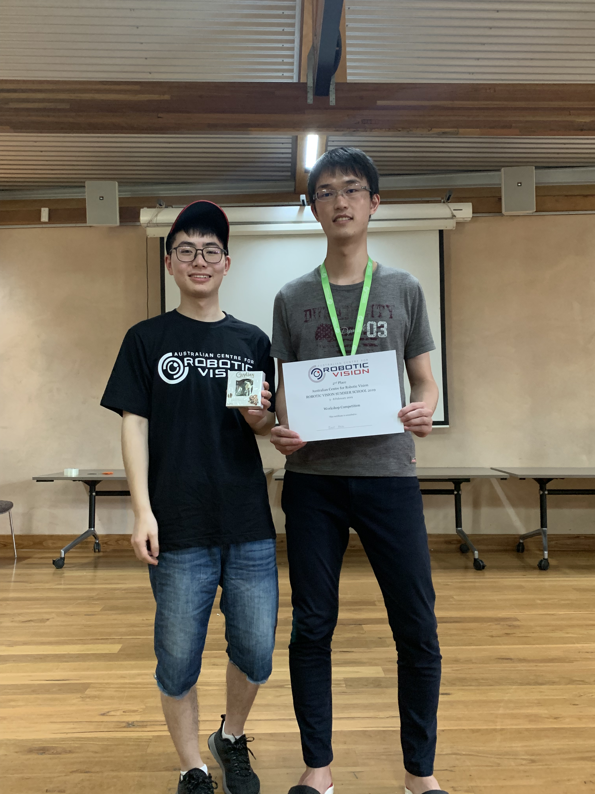
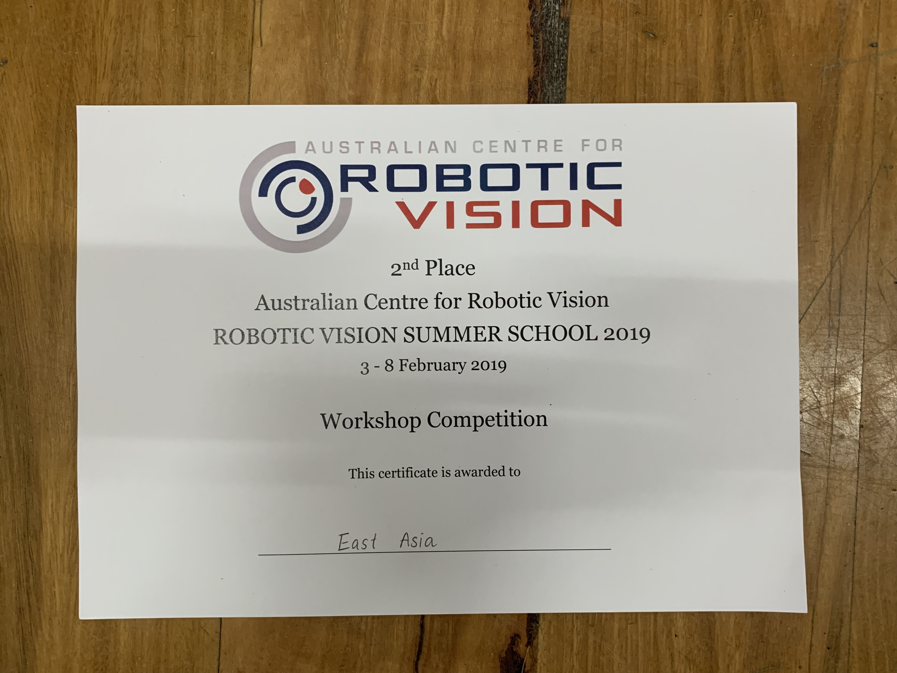

# RVSS2019-WS
Repo for the workshop part of the [Australian Centre for Robotic Vision Summer School RVSS2019](https://www.roboticvision.org/rvss2019)

## The Workshop
Train a CNN and deploy it on a mobile robot to follow a track. 
more [details can be found here](https://sites.google.com/view/rvss2019ws/overview)

## Installation

```bash
make install
```

## Development

```bash
# on_robot
ssh penguinpi

cd RVSS2019-WS/on_robot/collect_data
python3 collect.py
```

```bash
# on_laptop

cd RVSS2019-WS/on_laptop
./download_data.sh

./view_dataset.py

./train.py
./plot_loss.py logs/XXX

./deploy.sh
```

```bash
# on_robot
cd RVSS2019-WS/on_robot/deploy
python3 deploy0.py
```

## Results @RVSS2019

Out team, East Asia, got 2nd award at RVSS2019.

 


